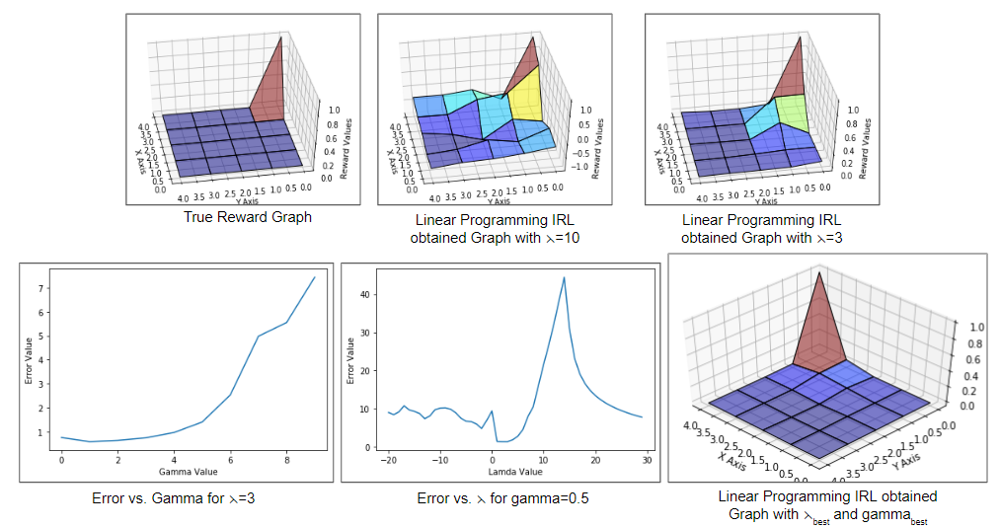
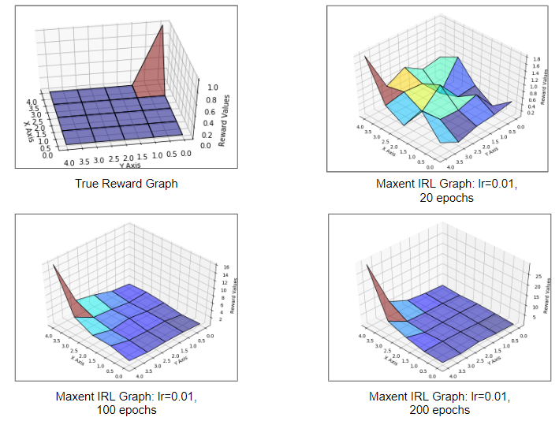
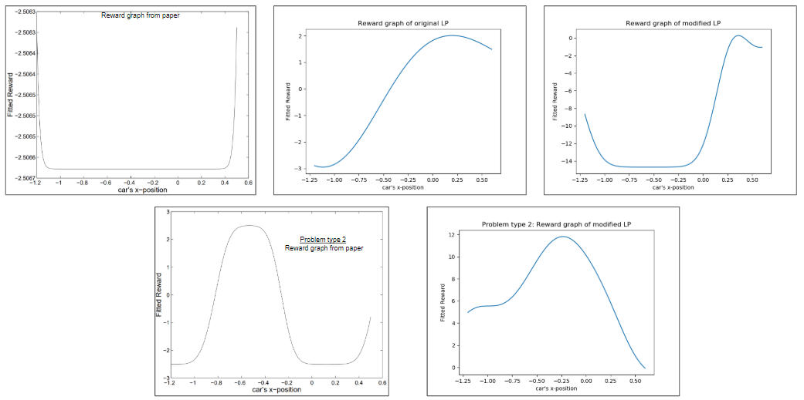
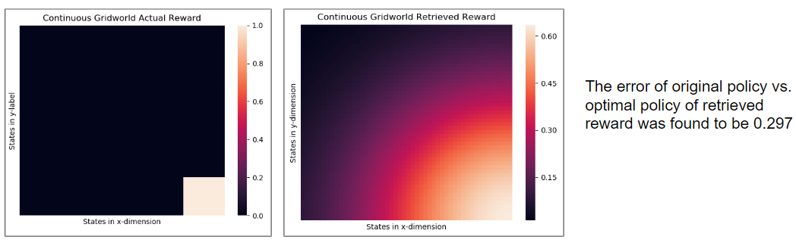
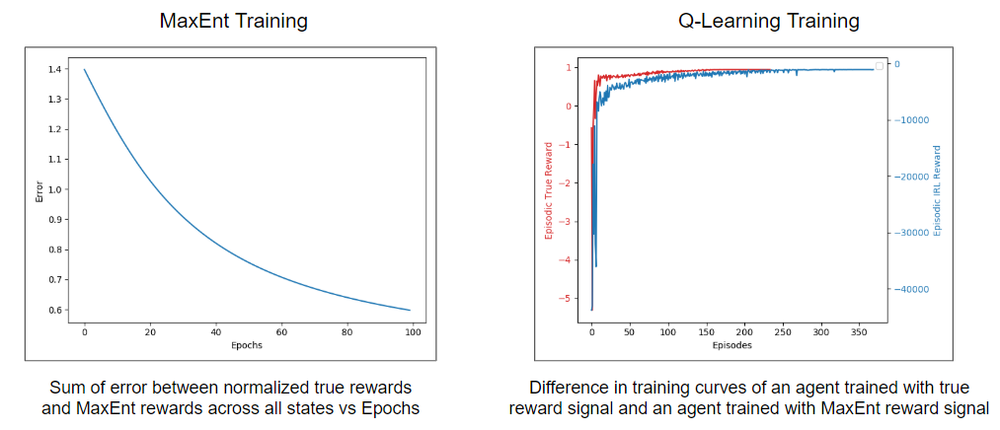

# inverse_rl
Implementing the two pioneering IRL papers "Algorithms for Inverse Reinforcement Learning" - (Ng &amp;Russell 2000) and "Maximum Entropy Inverse Reinforcement Learning" - (Ziebart et al.  2008)

### Goal of the Project
Implement the paper "Algorithms for Inverse Reinforcement Learning" - (Ng & Russell 2000) and replicate results for,
- Finite State Space: Gridworld
- Large State Space: Mountain Car
- Through Sampled Trajectories: Continuous Gridworld

Implement the paper "Maximum Entropy Inverse Reinforcement Learning" - (Ziebart et al. 2008) and replicate results for,
- Simple Gridworld
- 2-D Maze

## Results
#### Linear Programming IRL - Discrete Gridworld

#### Max Entropy IRL - Discrete Gridworld

#### Linear Programming IRL - Mountain Car

#### Linear Programming IRL - Continuous Gridworld

#### Max Entropy IRL for 2-D Maze

